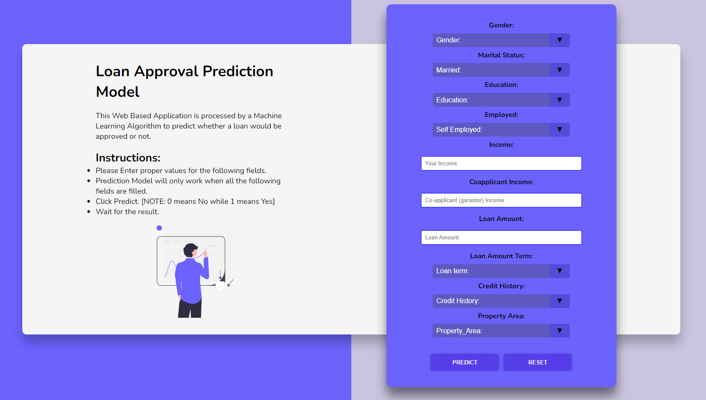

# LoanApprovalPredictionModel_Website 

I recently teamed up with some higher-ups on a cool project where we created a predictive model that determines whether or not someone is eligible for a loan. As part of my contribution, I was tasked with sprucing up the front-end of the website. They gave me a page that was already designed with Bootstrap, and I took it to the next level by using Vanilla CSS to make it more professional and responsive. Overall, it was a fun project that allowed me to flex my creative muscles!

## Concepts used:
- **Vanilla CSS**

  > 
  >
  > 

## Final Output:

